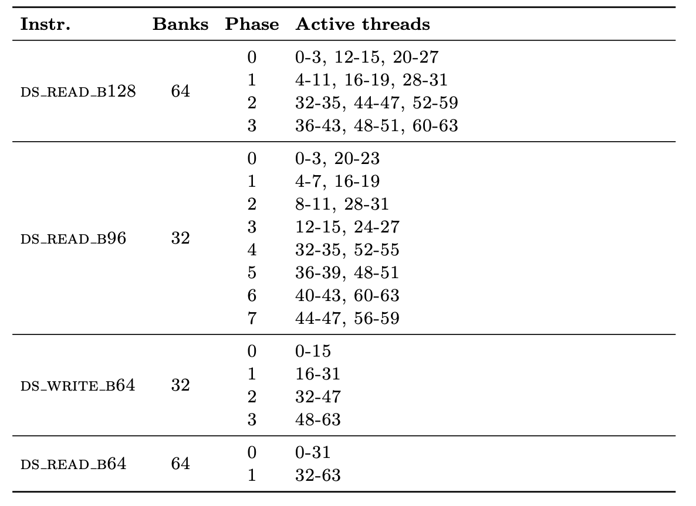
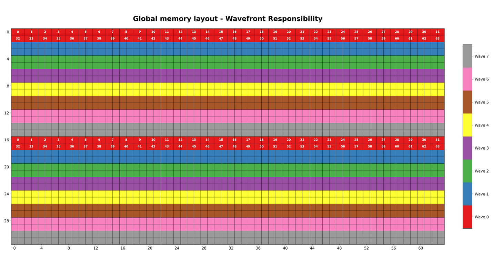
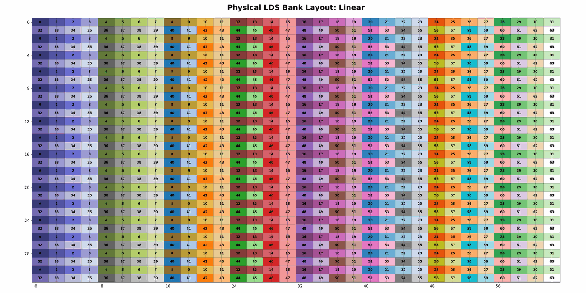
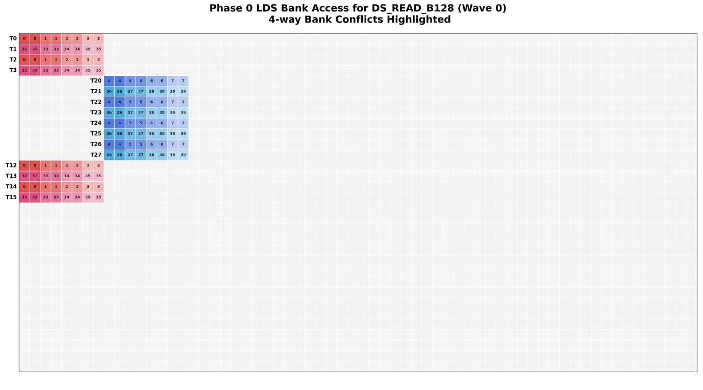
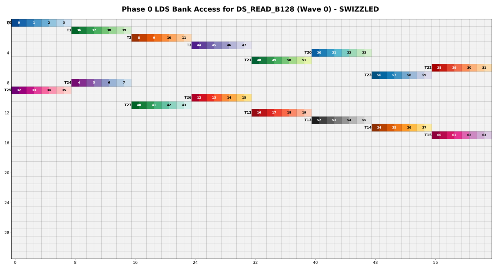
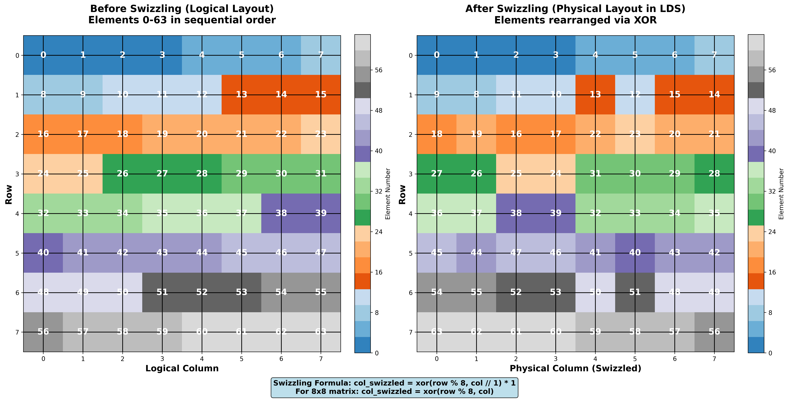

**MI350: LDS Bank Conflicts and Swizzling**

This document demonstrates the importance of bank swizzling to prevent
bank conflicts in kernels where the granularity of gather and read
operations differ and it proposes a solution based on XOR logic.

**Local Data Share (LDS)**

LDS is the high-speed "scratchpad" memory within each CU.

- **Banking**: LDS is divided into **64 banks**, each **4 bytes** wide.

- **Throughput**: Each bank supports reads, writes, or atomic updates
  every cycle with a total throughput of **256B/clock**.

- **Execution Phases**:
   When a wavefront of 64 threads performs a read or write operation to
   LDS, the hardware typically processes the request in multiple
   execution phases. The specific number of phases required, and which
   threads are grouped together in each phase, depends entirely on the
   instruction type. For instance, a ds_read_b128 instruction is
   processed in four distinct phases. The specific "teaming up" of
   threads for these phases was reverse-engineered in the Hipkittens
   paper, showing exactly which lanes compete for banks at the same
   time.

   | |image1|
   | Figure: Table reproduced from the HipKittens paper  [1]_

**How Bank conflicts occur**

When a wavefront performs an LDS operation like ds_read_b128, the
hardware typically processes the 64 threads in four phases. If there are
no bank conflicts, the hardware can issue one phase to the LDS request
queue every cycle. This means the entire instruction is fully issued in
just 4 cycles.

If multiple threads within a single phase target the same bank, the
hardware cannot process them simultaneously. Instead, it
must serialize the access. The hardware is stalled trying to clear the
conflict. If for instance you have a 4-way bank conflict, a phase that
should have taken 1 cycle to issue now takes 4 cycles.

**Let’s illustrate the bank conflicts with a concrete example**

We will examine the mapping of a **32x64 f16 tile** from Global Memory
to LDS, followed by a MMA operation.

This specific access pattern is derived from a kernel generated by Wave.
We focus on the loading of Tile B (from AxB=C), as it serves as a test
case where the producer and the consumer utilize different data
granularities. The full IR for this kernel is provided at the end of the
document.

The two operations to analyze are:

1. **Gather_to_lds (producer)**

We utilize two amdgpu.gather_to_lds operations, each moving
a vector<2xf16> (4 bytes). At this granularity, each thread targets
a single bank per operation.

2. **Vector.load (consumer)**

We subsequently perform a vector.load of a vector<8xf16> (16 bytes).
This instruction requires each thread to access four consecutive
banks simultaneously.

The amdgpu.gather_to_lds instruction provides each thread with a
specific source index in global memory while targeting a shared base
destination index in LDS. The hardware then automatically offsets each
thread’s write location linearly.

In a naive mapping (where no swizzling is applied), the relationship
between the waves/threads and the data in global memory is shown below:

|image2|

Once the data is moved, it is laid out sequentially in LDS. The
following image shows how this tile appears in the physical LDS banks.:

|image3|

After the data is populated in LDS, each thread must load a specific
chunk of the tile into its registers to perform the MMA operation
(MMAType.F32_16x16x32_F16). This is executed using
the ds_read_b128 instruction.

Because the hardware processes a wavefront in four phases, the read is
spread across time. In this kernel, Phase 0 involves threads **0–3,
12–15, and 20–27** (see hipKittens Table) Each thread attempts to load a
8 element vector which requires access to four consecutive
banks simultaneously.

When using the linear mapping, the threads in Phase 0 access the LDS
banks as follows:

|image4|

You can observe a 4-way bank conflict . Threads 0, 2,12 and 14 all
access the same banks (0/1/2/3). This instruction’s phase will end up
taking 4 times longer.

**Swizzling Solution**

To resolve the performance bottleneck caused by bank conflicts, we must
ensure that threads within the same phase access different hardware
columns or unique LDS banks. This can be achieved through **Bank
Swizzling.**

Applying a swizzling logic transforms the memory layout, resulting in
the conflict free access pattern shown below for Phase 0:

|image5|

Each thread’s access has been “diagonalized”, each touches a different
bank at the same time.

**Swizzling Implementation: Handling Mismatched Granularity**

There isn't one single swizzle solution that works for every
kernel. Because different LDS instructions have different memory
footprints, your swizzling solution must adapt.

**Swizzle unit**

In the example above, we face a granularity mismatch: the producer
(gather_to_lds) writes 2 elements per thread, while the consumer
(vector.load) reads 8 elements per thread.

If we swizzled at the granularity of the producer (2 elements), the
8-element chunk required by the reader would be "shattered" across
non-contiguous banks, breaking the vector load. To prevent this, we
define a **Swizzle Unit** based on the largest access width.

**XOR Mapping**

The swizzling transforms the Logical Column Index into a Swizzled Column
Index using an XOR-based permutation. This "diagonalizes" the data
across the LDS banks.

We use the Row as a "phase shifter" or a tracker. It’s the easiest way
to ensure that data from different row, which would normally stack up
and collide on the same bank, gets pushed to a different horizontal
location.

To make sure our XOR math doesn't result in a column index that is "out
of bounds" (larger than our 64 column tile), we introduce a **Max
Phase**.

**Final Formula:**

**Swizzled Column Chunk = (Logical Column Chunk) XOR (Row % Max Phase)**

**Conflict - Free Exceptions**

There are specific scenarios where bank conflict persist even after
swizzling has been applied.

1. One exception is when the producer’s granularity is larger than the
   consumer’s granularity. If the producer writes data into LDS using a
   large 16-element vector but the consumer subsequently reads in
   2-element chunks, we may encounter a situation where multiple threads
   within the same phase attempt to read from that same large "brick" of
   data. In that case we still experience a bank conflict as they both
   target the same physical bank.

2. Another limitation: when the number of rows accessed by a single
   phase exceeds the number of available column chunks, a conflict is
   inevitable. Because the XOR logic only has a limited number of
   horizontal slots to move data into, some rows will eventually be
   forced to share the same physical banks.

**Swizzling in Practice**

To replicate aboves swizzled layout lets apply the XOR logic to Thread
1.

Two important metrics to set: the swizzle_unit and max_phase.

**Swizzle_unit** = max (gather.elements_per_thread,
read.elements_per_thread)= 8

**Max_phase=** min(8, num_swizzle_chunks)= min(8,
col_size//swizzle_unit)= min(8,64//8)=8

Step 1. (Column Chunk): col // swizzle_unit = 0 // 8 = 0.

Step 2. (Row Phase): row % max_phase = 1 % 8 = 1.

Step 3. (XOR Swizzle): XOR(RowPhase, ColChunk) = XOR(1, 0) = 1.

Step 4. (New Physical Column): 1 \* swizzle_unit = 1 \* 8 = 8.

**New Bank Calculation:**

New Physical Coordinates: (Row: 1, Col: 8 )

Bank Formula: (Row \* 32 + Col // 2) % 64 = (1 \* 32 + 8 // 2) % 64 =
(32 + 4) % 64 = 36

Final Result: Thread 1 now accesses Banks 36, 37, 38, 39 (8 bf16
elements = 4 banks)

**Visual example of an 8x8 Tile before and after swizzling:**

In this example, we use max_phase of 8 and swizzle_unit of 1.

|image6|

**Reference Wave Kernel**

.. code-block:: mlir

   #map = affine_map<()[s0, s1, s2] -> (s1 * 32 + s2 * 64 + s0 floordiv 8 - ((s1 * 32 + s0 floordiv 8) floordiv 64) * 64)>

   #map1 = affine_map<()[s0] -> ((s0 floordiv 8) mod 8)>

   #map2 = affine_map<()[s0] -> (s0 mod 8)>

   #map3 = affine_map<()[s0] -> (s0 * 8)>

   #map4 = affine_map<()[s0, s1] -> (s1 * 32 + (s0 floordiv 64) * 8 - ((s1 * 4 + s0 floordiv 64) floordiv 8) * 64)>

   #map5 = affine_map<()[s0, s1, s2] -> (s1 * 8 + s2 * 32 + s0 floordiv 32 - ((s1 * 8 + s0 floordiv 32) floordiv 32) * 32)>

   #map6 = affine_map<()[s0] -> ((s0 floordiv 32) mod 8)>

   #map7 = affine_map<()[s0] -> ((s0 mod 32) floordiv 4)>

   #map8 = affine_map<()[s0, s1] -> (s0 * 8 + s1 * 2 - (s1 floordiv 32) * 64 - ((s1 mod 32) floordiv 4) * 8)>

   #map9 = affine_map<()[s0, s1] -> (s1 * 8 + (s0 floordiv 64) * 2 - ((s1 * 4 + s0 floordiv 64) floordiv 16) * 32)>

   #map10 = affine_map<()[s0, s1, s2] -> (s1 * 8 + s2 * 32 + s0 floordiv 32 - ((s1 * 8 + s0 floordiv 32 + 16) floordiv 32) * 32 + 16)>

   #map11 = affine_map<()[s0, s1] -> (s1 * 8 + (s0 floordiv 64) * 2 - ((s1 * 4 + s0 floordiv 64 + 8) floordiv 16) * 32 + 16)>

   #map12 = affine_map<()[s0] -> (s0 * 8 + 64)>

   #map13 = affine_map<()[s0, s1] -> (s0 * 8 + s1 * 2 - (s1 floordiv 32) * 64 - ((s1 mod 32) floordiv 4) * 8 + 64)>

   #map14 = affine_map<()[s0, s1] -> (s1 * 4 + s0 floordiv 64)>

   #map15 = affine_map<()[s0] -> (s0 mod 16 + (s0 floordiv 64) * 16)>

   #map16 = affine_map<()[s0] -> ((s0 mod 64) floordiv 16)>

   #map17 = affine_map<()[s0, s1] -> (s0 + s1 * 16 - (s0 floordiv 16) * 16)>

   #map18 = affine_map<()[s0] -> ((s0 mod 64) floordiv 16 + 4)>

   #map19 = affine_map<()[s0, s1] -> (s0 * 64 + s1 * 8 + 128)>

   #map20 = affine_map<()[s0, s1, s2] -> (s0 * 64 + s1 * 8 + s2 * 2 - (s2 floordiv 32) * 64 - ((s2 mod 32) floordiv 4) * 8 + 128)>

   #map21 = affine_map<()[s0, s1] -> (s0 * 64 + s1 * 8 + 192)>

   #map22 = affine_map<()[s0, s1, s2] -> (s0 * 64 + s1 * 8 + s2 * 2 - (s2 floordiv 32) * 64 - ((s2 mod 32) floordiv 4) * 8 + 192)>

   #map23 = affine_map<()[s0, s1] -> (s0 * 64 + (s1 floordiv 64) * 16 + ((s1 mod 64) floordiv 16) * 4)>

   #map24 = affine_map<()[s0, s1, s2] -> (s0 + s1 * 32 + s2 * 16 - (s0 floordiv 16) * 16)>

   #map25 = affine_map<()[s0, s1] -> (s0 * 64 + (s1 floordiv 64) * 16 + ((s1 mod 64) floordiv 16) * 4 + 1)>

   #map26 = affine_map<()[s0, s1] -> (s0 * 64 + (s1 floordiv 64) * 16 + ((s1 mod 64) floordiv 16) * 4 + 2)>

   #map27 = affine_map<()[s0, s1] -> (s0 * 64 + (s1 floordiv 64) * 16 + ((s1 mod 64) floordiv 16) * 4 + 3)>

   #translation = #iree_codegen.translation_info<pipeline = None workgroup_size = [256, 2, 1] subgroup_size = 64>

   module attributes {transform.with_named_sequence} {
     stream.executable private @gemm_prefetch {
     stream.executable.export public @gemm_prefetch workgroups() -> (index, index, index) {
     %c2 = arith.constant 2 : index

     %c8 = arith.constant 8 : index

     %c1 = arith.constant 1 : index

       stream.return %c2, %c8, %c1 : index, index, index
     }

     builtin.module {
     func.func @gemm_prefetch(%arg0: !stream.binding, %arg1: !stream.binding, %arg2: !stream.binding) attributes {translation_info = #translation} {
       %c4_i32 = arith.constant 4 : i32

       %c1024_i14 = arith.constant 1024 : i14

       %c14 = arith.constant 14 : index

       %c2 = arith.constant 2 : index

       %c2147483645_i64 = arith.constant 2147483645 : i64

       %c1024 = arith.constant 1024 : index

       %cst = arith.constant dense<0.000000e+00> : vector<4xf32>

       %c0 = arith.constant 0 : index

       %0 = stream.binding.subspan %arg0[%c0] : !stream.binding -> memref<f16>

       %1 = stream.binding.subspan %arg1[%c0] : !stream.binding -> memref<f16>

       %2 = stream.binding.subspan %arg2[%c0] : !stream.binding -> memref<f32>

       %block_id_x = gpu.block_id x upper_bound 2

       %block_id_y = gpu.block_id y upper_bound 8

       %thread_id_x = gpu.thread_id x upper_bound 256

       %thread_id_y = gpu.thread_id y upper_bound 2

       %reinterpret_cast = memref.reinterpret_cast %2 to offset: [0], sizes: [128, 256], strides: [256, 1] : memref<f32> to memref<128x256xf32, strided<[256, 1]>>

       %alloc = memref.alloc() : memref<32x64xf16, #gpu.address_space<workgroup>>

       %alloc_0 = memref.alloc() : memref<32x64xf16, #gpu.address_space<workgroup>>

       %alloc_1 = memref.alloc() : memref<32x64xf16, #gpu.address_space<workgroup>>

       %alloc_2 = memref.alloc() : memref<64x64xf16, #gpu.address_space<workgroup>>

       %alloc_3 = memref.alloc() : memref<64x64xf16, #gpu.address_space<workgroup>>

       %alloc_4 = memref.alloc() : memref<64x64xf16, #gpu.address_space<workgroup>>

       %3 = affine.apply #map()[%thread_id_x, %thread_id_y, %block_id_x]

       %4 = affine.apply #map1()[%thread_id_x]

       %5 = affine.apply #map2()[%thread_id_x]

       %6 = arith.xori %5, %4 : index

       %7 = affine.apply #map3()[%6]

       %8 = affine.apply #map4()[%thread_id_x, %thread_id_y]

       %9 = gpu.subgroup_broadcast %8, first_active_lane : index

       %10 = gpu.subgroup_broadcast %c0, first_active_lane : index

       %11 = arith.muli %3, %c1024 overflow<nsw> : index

       %12 = arith.addi %11, %7 overflow<nsw> : index

       %reinterpret_cast_5 = memref.reinterpret_cast %0 to offset: [0], sizes: [1073741822], strides: [1] : memref<f16> to memref<1073741822xf16, strided<[1]>>

       %cast = memref.cast %reinterpret_cast_5 : memref<1073741822xf16, strided<[1]>> to memref<?xf16, strided<[1], offset: ?>>

       %13 = amdgpu.fat_raw_buffer_cast %cast validBytes(%c2147483645_i64) cacheSwizzleStride(%c1024_i14) resetOffset : memref<?xf16, strided<[1], offset: ?>> to memref<?xf16, #amdgpu.address_space<fat_raw_buffer>>

       amdgpu.gather_to_lds %13[%12], %alloc_4[%9, %10] : vector<8xf16>, memref<?xf16, #amdgpu.address_space<fat_raw_buffer>>, memref<64x64xf16, #gpu.address_space<workgroup>>

       %14 = affine.apply #map5()[%thread_id_x, %thread_id_y, %block_id_y]

       %15 = affine.apply #map6()[%thread_id_x]

       %16 = affine.apply #map7()[%thread_id_x]

       %17 = arith.xori %16, %15 : index

       %18 = affine.apply #map8()[%17, %thread_id_x]

       %19 = affine.apply #map9()[%thread_id_x, %thread_id_y]

       %20 = gpu.subgroup_broadcast %19, first_active_lane : index

       %21 = arith.muli %14, %c1024 overflow<nsw> : index

       %22 = arith.addi %21, %18 overflow<nsw> : index

       %reinterpret_cast_6 = memref.reinterpret_cast %1 to offset: [0], sizes: [1073741822], strides: [1] : memref<f16> to memref<1073741822xf16, strided<[1]>>

       %cast_7 = memref.cast %reinterpret_cast_6 : memref<1073741822xf16, strided<[1]>> to memref<?xf16, strided<[1], offset: ?>>

       %23 = amdgpu.fat_raw_buffer_cast %cast_7 validBytes(%c2147483645_i64) cacheSwizzleStride(%c1024_i14) resetOffset : memref<?xf16, strided<[1], offset: ?>> to memref<?xf16, #amdgpu.address_space<fat_raw_buffer>>

       amdgpu.gather_to_lds %23[%22], %alloc_1[%20, %10] : vector<2xf16>, memref<?xf16, #amdgpu.address_space<fat_raw_buffer>>, memref<32x64xf16, #gpu.address_space<workgroup>>

       %24 = affine.apply #map10()[%thread_id_x, %thread_id_y, %block_id_y]

       %25 = affine.apply #map11()[%thread_id_x, %thread_id_y]

       %26 = gpu.subgroup_broadcast %25, first_active_lane : index

       %27 = arith.muli %24, %c1024 overflow<nsw> : index

       %28 = arith.addi %27, %18 overflow<nsw> : index

       amdgpu.gather_to_lds %23[%28], %alloc_1[%26, %10] : vector<2xf16>, memref<?xf16, #amdgpu.address_space<fat_raw_buffer>>, memref<32x64xf16, #gpu.address_space<workgroup>>

       %29 = affine.apply #map12()[%6]

       %30 = arith.addi %11, %29 overflow<nsw> : index

       amdgpu.gather_to_lds %13[%30], %alloc_3[%9, %10] : vector<8xf16>, memref<?xf16, #amdgpu.address_space<fat_raw_buffer>>, memref<64x64xf16, #gpu.address_space<workgroup>>

       %31 = affine.apply #map13()[%17, %thread_id_x]

       %32 = arith.addi %21, %31 overflow<nsw> : index

       amdgpu.gather_to_lds %23[%32], %alloc_0[%20, %10] : vector<2xf16>, memref<?xf16, #amdgpu.address_space<fat_raw_buffer>>, memref<32x64xf16, #gpu.address_space<workgroup>>

       %33 = arith.addi %27, %31 overflow<nsw> : index

       amdgpu.gather_to_lds %23[%33], %alloc_0[%26, %10] : vector<2xf16>, memref<?xf16, #amdgpu.address_space<fat_raw_buffer>>, memref<32x64xf16, #gpu.address_space<workgroup>>

       %34 = affine.apply #map14()[%thread_id_x, %thread_id_y]

       %35 = arith.index_cast %34 : index to i32

       %36 = arith.cmpi sge, %35, %c4_i32 : i32

       %37 = arith.cmpi slt, %35, %c4_i32 : i32

       scf.if %36 {
         rocdl.s.barrier
       }

       %38 = affine.apply #map15()[%thread_id_x]

       %39 = affine.apply #map16()[%thread_id_x]

       %40 = arith.xori %39, %5 : index

       %41 = affine.apply #map3()[%40]

       %42 = affine.apply #map17()[%thread_id_x, %thread_id_y]

       %43 = affine.apply #map18()[%thread_id_x]

       %44 = arith.xori %43, %5 : index

       %45 = affine.apply #map3()[%44]

       %46:7 = scf.for %arg3 = %c0 to %c14 step %c2 iter_args(%arg4 = %cst, %arg5 = %alloc_4, %arg6 = %alloc_3, %arg7 = %alloc_2, %arg8 = %alloc_1, %arg9 = %alloc_0, %arg10 = %alloc) -> (vector<4xf32>, memref<64x64xf16, #gpu.address_space<workgroup>>, memref<64x64xf16, #gpu.address_space<workgroup>>, memref<64x64xf16, #gpu.address_space<workgroup>>, memref<32x64xf16, #gpu.address_space<workgroup>>, memref<32x64xf16, #gpu.address_space<workgroup>>, memref<32x64xf16, #gpu.address_space<workgroup>>) {
         amdgpu.memory_counter_wait load(3)

         rocdl.s.barrier

         rocdl.s.barrier

         %76 = vector.load %arg5[%38, %41] : memref<64x64xf16, #gpu.address_space<workgroup>>, vector<8xf16>

         %77 = vector.load %arg8[%42, %41] : memref<32x64xf16, #gpu.address_space<workgroup>>, vector<8xf16>

         rocdl.sched.barrier 0

         %78 = affine.apply #map19()[%arg3, %6]

         %79 = arith.addi %11, %78 overflow<nsw> : index

         amdgpu.gather_to_lds %13[%79], %arg7[%9, %10] : vector<8xf16>, memref<?xf16, #amdgpu.address_space<fat_raw_buffer>>, memref<64x64xf16, #gpu.address_space<workgroup>>

         %80 = affine.apply #map20()[%arg3, %17, %thread_id_x]

         %81 = arith.addi %21, %80 overflow<nsw> : index

         amdgpu.gather_to_lds %23[%81], %arg10[%20, %10] : vector<2xf16>, memref<?xf16, #amdgpu.address_space<fat_raw_buffer>>, memref<32x64xf16, #gpu.address_space<workgroup>>

         %82 = arith.addi %27, %80 overflow<nsw> : index

         amdgpu.gather_to_lds %23[%82], %arg10[%26, %10] : vector<2xf16>, memref<?xf16, #amdgpu.address_space<fat_raw_buffer>>, memref<32x64xf16, #gpu.address_space<workgroup>>

         rocdl.sched.barrier 0

         rocdl.s.barrier

         rocdl.sched.barrier 0

         rocdl.s.setprio 1

         %83 = amdgpu.mfma 16x16x32 %76 * %77 + %arg4 blgp = none : vector<8xf16>, vector<8xf16>, vector<4xf32>

         rocdl.s.setprio 0

         rocdl.sched.barrier 0

         rocdl.s.barrier

         rocdl.sched.barrier 0

         %84 = vector.load %arg5[%38, %45] : memref<64x64xf16, #gpu.address_space<workgroup>>, vector<8xf16>

         %85 = vector.load %arg8[%42, %45] : memref<32x64xf16, #gpu.address_space<workgroup>>, vector<8xf16>

         rocdl.sched.barrier 0

         rocdl.s.barrier

         rocdl.sched.barrier 0

         rocdl.s.setprio 1

         %86 = amdgpu.mfma 16x16x32 %84 * %85 + %83 blgp = none : vector<8xf16>, vector<8xf16>, vector<4xf32>

         rocdl.s.setprio 0

         rocdl.sched.barrier 0

         amdgpu.memory_counter_wait load(3)

         rocdl.s.barrier

         rocdl.s.barrier

         %87 = vector.load %arg6[%38, %41] : memref<64x64xf16, #gpu.address_space<workgroup>>, vector<8xf16>

         %88 = vector.load %arg9[%42, %41] : memref<32x64xf16, #gpu.address_space<workgroup>>, vector<8xf16>

         rocdl.sched.barrier 0

         %89 = affine.apply #map21()[%arg3, %6]

         %90 = arith.addi %11, %89 overflow<nsw> : index

         amdgpu.gather_to_lds %13[%90], %arg5[%9, %10] : vector<8xf16>, memref<?xf16, #amdgpu.address_space<fat_raw_buffer>>, memref<64x64xf16, #gpu.address_space<workgroup>>

         %91 = affine.apply #map22()[%arg3, %17, %thread_id_x]

         %92 = arith.addi %21, %91 overflow<nsw> : index

         amdgpu.gather_to_lds %23[%92], %arg8[%20, %10] : vector<2xf16>, memref<?xf16, #amdgpu.address_space<fat_raw_buffer>>, memref<32x64xf16, #gpu.address_space<workgroup>>

         %93 = arith.addi %27, %91 overflow<nsw> : index

         amdgpu.gather_to_lds %23[%93], %arg8[%26, %10] : vector<2xf16>, memref<?xf16, #amdgpu.address_space<fat_raw_buffer>>, memref<32x64xf16, #gpu.address_space<workgroup>>

         rocdl.sched.barrier 0

         rocdl.s.barrier

         rocdl.sched.barrier 0

         rocdl.s.setprio 1

         %94 = amdgpu.mfma 16x16x32 %87 * %88 + %86 blgp = none : vector<8xf16>, vector<8xf16>, vector<4xf32>

         rocdl.s.setprio 0

         rocdl.sched.barrier 0

         rocdl.s.barrier

         rocdl.sched.barrier 0

         %95 = vector.load %arg6[%38, %45] : memref<64x64xf16, #gpu.address_space<workgroup>>, vector<8xf16>

         %96 = vector.load %arg9[%42, %45] : memref<32x64xf16, #gpu.address_space<workgroup>>, vector<8xf16>

         rocdl.sched.barrier 0

         rocdl.s.barrier

         rocdl.sched.barrier 0

         rocdl.s.setprio 1

         %97 = amdgpu.mfma 16x16x32 %95 * %96 + %94 blgp = none : vector<8xf16>, vector<8xf16>, vector<4xf32>

         rocdl.s.setprio 0

         rocdl.sched.barrier 0

         scf.yield %97, %arg7, %arg5, %arg6, %arg10, %arg8, %arg9 : vector<4xf32>, memref<64x64xf16, #gpu.address_space<workgroup>>, memref<64x64xf16, #gpu.address_space<workgroup>>, memref<64x64xf16, #gpu.address_space<workgroup>>, memref<32x64xf16, #gpu.address_space<workgroup>>, memref<32x64xf16, #gpu.address_space<workgroup>>, memref<32x64xf16, #gpu.address_space<workgroup>>

       }

       scf.if %37 {
         rocdl.s.barrier
       }

       %47 = affine.apply #map17()[%thread_id_x, %thread_id_y]

       %48 = affine.apply #map16()[%thread_id_x]

       %49 = arith.xori %48, %5 : index

       %50 = affine.apply #map3()[%49]

       %51 = vector.load %46#4[%47, %50] : memref<32x64xf16, #gpu.address_space<workgroup>>, vector<8xf16>

       %52 = affine.apply #map18()[%thread_id_x]

       %53 = arith.xori %52, %5 : index

       %54 = affine.apply #map3()[%53]

       %55 = vector.load %46#4[%47, %54] : memref<32x64xf16, #gpu.address_space<workgroup>>, vector<8xf16>

       %56 = affine.apply #map15()[%thread_id_x]

       %57 = vector.load %46#1[%56, %50] : memref<64x64xf16, #gpu.address_space<workgroup>>, vector<8xf16>

       %58 = vector.load %46#1[%56, %54] : memref<64x64xf16, #gpu.address_space<workgroup>>, vector<8xf16>

       %59 = amdgpu.mfma 16x16x32 %57 * %51 + %46#0 blgp = none : vector<8xf16>, vector<8xf16>, vector<4xf32>

       %60 = amdgpu.mfma 16x16x32 %58 * %55 + %59 blgp = none : vector<8xf16>, vector<8xf16>, vector<4xf32>

       %61 = vector.load %46#5[%47, %50] : memref<32x64xf16, #gpu.address_space<workgroup>>, vector<8xf16>

       %62 = vector.load %46#5[%47, %54] : memref<32x64xf16, #gpu.address_space<workgroup>>, vector<8xf16>

       %63 = vector.load %46#2[%56, %50] : memref<64x64xf16, #gpu.address_space<workgroup>>, vector<8xf16>

       %64 = vector.load %46#2[%56, %54] : memref<64x64xf16, #gpu.address_space<workgroup>>, vector<8xf16>

       %65 = amdgpu.mfma 16x16x32 %63 * %61 + %60 blgp = none : vector<8xf16>, vector<8xf16>, vector<4xf32>

       %66 = amdgpu.mfma 16x16x32 %64 * %62 + %65 blgp = none : vector<8xf16>, vector<8xf16>, vector<4xf32>

       %67 = vector.extract_strided_slice %66 {offsets = [0], sizes = [1], strides = [1]} : vector<4xf32> to vector<1xf32>

       %68 = affine.apply #map23()[%block_id_x, %thread_id_x]

       %69 = affine.apply #map24()[%thread_id_x, %block_id_y, %thread_id_y]

       vector.store %67, %reinterpret_cast[%68, %69] : memref<128x256xf32, strided<[256, 1]>>, vector<1xf32>

       %70 = vector.extract_strided_slice %66 {offsets = [1], sizes = [1], strides = [1]} : vector<4xf32> to vector<1xf32>

       %71 = affine.apply #map25()[%block_id_x, %thread_id_x]

       vector.store %70, %reinterpret_cast[%71, %69] : memref<128x256xf32, strided<[256, 1]>>, vector<1xf32>

       %72 = vector.extract_strided_slice %66 {offsets = [2], sizes = [1], strides = [1]} : vector<4xf32> to vector<1xf32>

       %73 = affine.apply #map26()[%block_id_x, %thread_id_x]

       vector.store %72, %reinterpret_cast[%73, %69] : memref<128x256xf32, strided<[256, 1]>>, vector<1xf32>

       %74 = vector.extract_strided_slice %66 {offsets = [3], sizes = [1], strides = [1]} : vector<4xf32> to vector<1xf32>

       %75 = affine.apply #map27()[%block_id_x, %thread_id_x]

       vector.store %74, %reinterpret_cast[%75, %69] : memref<128x256xf32, strided<[256, 1]>>, vector<1xf32>

       return
     }

   }

   }

     func.func @isolated_benchmark$async(%arg0: !hal.buffer_view, %arg1: !hal.buffer_view, %arg2: !hal.buffer_view, %arg3: !hal.fence, %arg4: !hal.fence) -> !hal.buffer_view {
       %0 = hal.tensor.import wait(%arg3) => %arg0 : !hal.buffer_view -> tensor<128x1024xf16>

       %1 = hal.tensor.import wait(%arg3) => %arg1 : !hal.buffer_view -> tensor<256x1024xf16>

       %2 = hal.tensor.import wait(%arg3) => %arg2 : !hal.buffer_view -> tensor<128x256xf32>

       %3 = flow.dispatch @gemm_prefetch::@gemm_prefetch(%0, %1, %2) : (tensor<128x1024xf16>, tensor<256x1024xf16>, tensor<128x256xf32>) -> %2

       %4 = hal.tensor.barrier join(%3 : tensor<128x256xf32>) => %arg4 : !hal.fence

       %5 = hal.tensor.export %4 : tensor<128x256xf32> -> !hal.buffer_view

       return %5 : !hal.buffer_view
     }
   }

.. [1]
   https://arxiv.org/pdf/2511.08083v1

